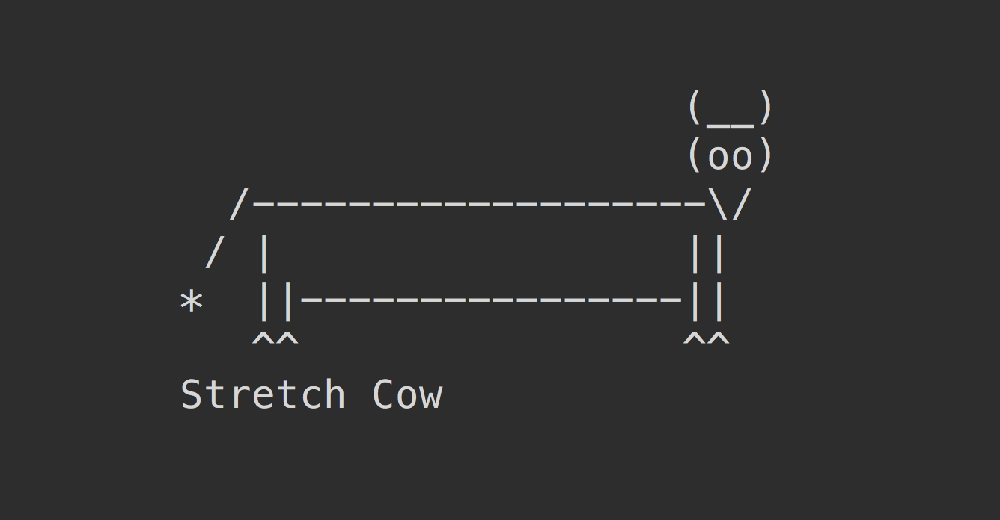

# vaca

> Get a random ASCII cow 🐮



## Install

```sh
npm install vaca
```

## Usage

```js
import vaca from 'vaca';

console.log(vaca());
//=> '...'
```

### CLI

```sh
npm install --global vaca
```

```sh
vaca
```

## Related

- [cows](https://github.com/sindresorhus/cows) - ASCII cows 🐮
